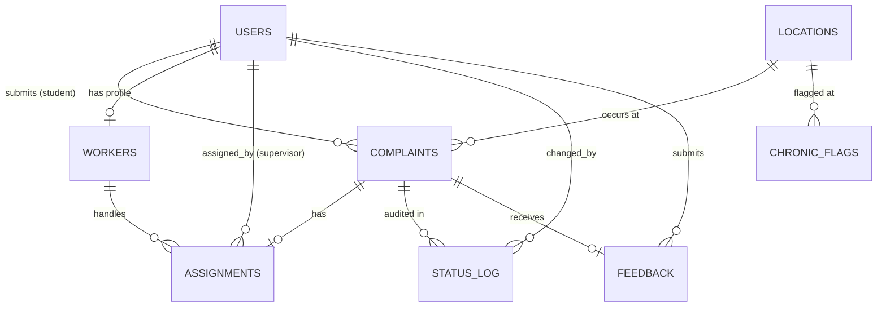

# Schema Design Document

**Project:** Campus Maintenance & Complaint Management System  
**Database:** Oracle  
**Normalization:** Third Normal Form (3NF)

---

## 1. Purpose

This schema supports end-to-end campus maintenance complaint handling: students file complaints against specific locations, supervisors assign specialized workers, status changes are audited, SLA deadlines are enforced, feedback drives performance scoring, and recurring issues are flagged automatically.

---

## 2. Entity-Relationship Diagram

### Visual ERD (Mermaid)

### Exportable diagram

- **Source file:** `docs/erd.dbml`
- **How to export PNG:** Open [dbdiagram.io](https://dbdiagram.io) → Import `erd.dbml` → Export as PNG → save to `assets/erd.png`

---

## 3. Tables Overview

| Table | Purpose | Primary Key |
|-------|---------|-------------|
| `USERS` | All system actors (student, worker, supervisor, admin) | `user_id` |
| `LOCATIONS` | Campus buildings, floors, and rooms | `location_id` |
| `COMPLAINTS` | Core complaint records with SLA and status | `complaint_id` |
| `WORKERS` | Worker profile linked 1:1 to a user account | `worker_id` |
| `ASSIGNMENTS` | Links a worker to a complaint; tracks cost and timing | `assignment_id` |
| `STATUS_LOG` | Audit trail for every complaint status change | `log_id` |
| `FEEDBACK` | Student rating and comment after resolution | `feedback_id` |
| `CHRONIC_FLAGS` | Recurring issue alerts (same location + category) | `flag_id` |
| `MAINTENANCE_REPORTS` | Monthly aggregated maintenance statistics | `report_id` |

---

## 4. Relationships

| Parent | Child | Cardinality | FK Column | Description |
|--------|-------|-------------|-----------|-------------|
| `USERS` | `COMPLAINTS` | 1 : N | `student_id` | A student submits many complaints |
| `LOCATIONS` | `COMPLAINTS` | 1 : N | `location_id` | A location can have many complaints |
| `USERS` | `WORKERS` | 1 : 1 | `user_id` | Each worker account maps to one user |
| `COMPLAINTS` | `ASSIGNMENTS` | 1 : N | `complaint_id` | A complaint may be reassigned over time |
| `WORKERS` | `ASSIGNMENTS` | 1 : N | `worker_id` | A worker handles many assignments |
| `USERS` | `ASSIGNMENTS` | 1 : N | `assigned_by` | Supervisor who made the assignment |
| `COMPLAINTS` | `STATUS_LOG` | 1 : N | `complaint_id` | Full status history per complaint |
| `USERS` | `STATUS_LOG` | 1 : N | `changed_by` | Who triggered each status change |
| `COMPLAINTS` | `FEEDBACK` | 1 : 1 | `complaint_id` | One feedback record per complaint |
| `USERS` | `FEEDBACK` | 1 : N | `student_id` | Student who submitted feedback |
| `LOCATIONS` | `CHRONIC_FLAGS` | 1 : N | `location_id` | Chronic flags per location + category |

---

## 5. Normalization Analysis (3NF)

### First Normal Form (1NF)
- All columns hold **atomic** (single) values.
- Each row is uniquely identified by a primary key.
- No repeating groups (e.g., multiple workers stored in one complaint row).

### Second Normal Form (2NF)
- All tables have a **single-column surrogate primary key** (`*_id`).
- No partial dependencies: every non-key attribute depends on the **whole** primary key.
- Example: `repair_cost` lives in `ASSIGNMENTS`, not `COMPLAINTS`, because cost is per assignment event.

### Third Normal Form (3NF)
- No **transitive dependencies** (non-key → non-key).
- `WORKERS` is separated from `USERS` so worker-specific attributes (`specialization`, `performance_score`, `is_available`) do not bloat the user table.
- `STATUS_LOG` is separated so status history does not create update anomalies in `COMPLAINTS`.
- `FEEDBACK` is separated so rating/comment data is independent of complaint lifecycle fields.
- `CHRONIC_FLAGS` is a derived alert table, not duplicated inside `COMPLAINTS`.
- `MAINTENANCE_REPORTS` stores pre-aggregated monthly snapshots instead of computing them inline.

### Intentional denormalization
- `sla_deadline` is stored on `COMPLAINTS` even though it is derivable from `priority` + `created_at`. This avoids repeated function calls in queries and supports indexed overdue lookups.
- `performance_score` is cached on `WORKERS` and refreshed by trigger after feedback — a controlled denormalization for dashboard performance.

---

## 6. Business Rules (enforced in DB layer)

| Rule | Enforcement |
|------|-------------|
| Priority → SLA: urgent = 4h, medium = 24h, low = 72h | Trigger on `COMPLAINTS` INSERT |
| Valid status transitions only | `CHECK` constraint + trigger logging |
| Rating must be 1–5 | `CHECK` on `FEEDBACK.rating` |
| One feedback per complaint | `UNIQUE` on `FEEDBACK.complaint_id` |
| Worker must match complaint category specialization | Stored procedure `assign_worker` |
| Chronic issue: 3+ complaints same location + category | Trigger on `COMPLAINTS` INSERT |
| Overdue assigned complaints auto-escalate | Procedure `escalate_overdue_complaints` |
| Every status change is logged | Trigger on `COMPLAINTS` UPDATE |

---

## 7. Indexes (planned for DDL)

| Index | Table | Columns | Reason |
|-------|-------|---------|--------|
| `idx_complaints_status` | `COMPLAINTS` | `status` | Filter active complaints |
| `idx_complaints_sla` | `COMPLAINTS` | `sla_deadline` | Overdue SLA queries |
| `idx_complaints_location_cat` | `COMPLAINTS` | `location_id, category` | Chronic issue detection |
| `idx_assignments_worker` | `ASSIGNMENTS` | `worker_id` | Worker workload views |
| `idx_status_log_complaint` | `STATUS_LOG` | `complaint_id` | Audit history lookup |

---

## 8. Role-Based Access (Push 13)

| Role | Access |
|------|--------|
| `student_role` | INSERT complaints, SELECT own complaints, INSERT feedback |
| `worker_role` | SELECT assigned complaints, UPDATE assignment status |
| `supervisor_role` | Assign workers, view all complaints, run escalation |
| `admin_role` | Full access including reports and chronic flags |

Implemented in `sql/plsql/06_transactions.sql`

---

## 9. File References

| Document | Path |
|----------|------|
| ERD source (dbdiagram.io) | `docs/erd.dbml` |
| Column-level definitions | `docs/data_dictionary.md` |
| DDL scripts (upcoming) | `sql/ddl/` |
